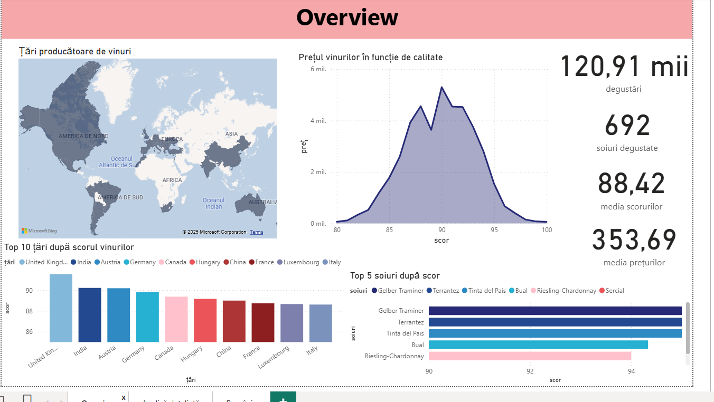
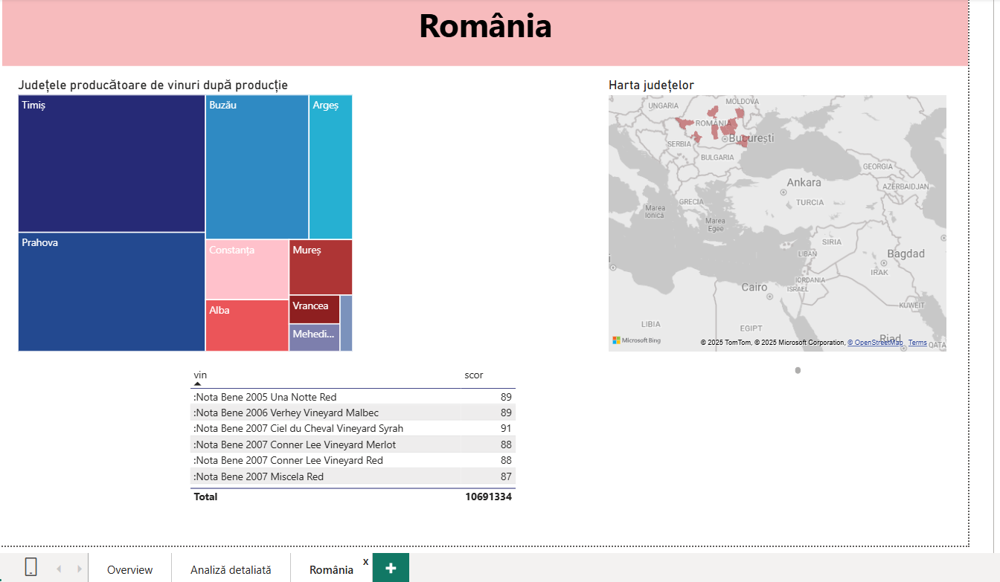
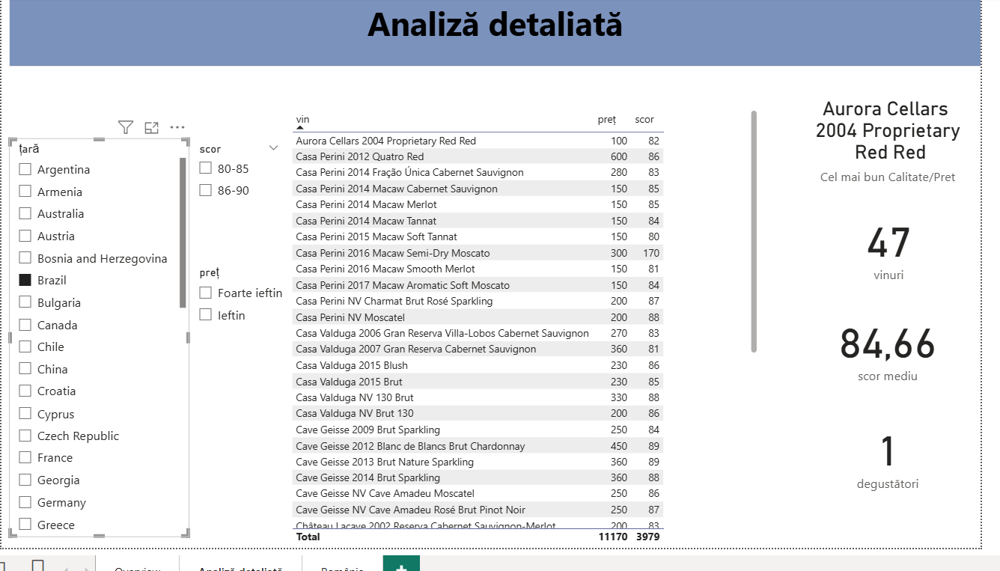

# Wine-Analysis-PowerBI
#  Power BI Dashboard – Analiza Vinurilor

Acest proiect Power BI explorează date despre vinuri din diferite țări, tipuri și prețuri.  
Scopul a fost de a identifica tendințele principale, regiunile cu cele mai bune scoruri și corelația dintre preț și calitate.

---

## Pagini din dashboard
###  Overview

###  România

###  Top țări

---

## 📂 Datele folosite
Datele provin de pe Kaggle:  
🔗 [Wine Reviews Dataset – Kaggle](https://www.kaggle.com/datasets/zynicide/wine-reviews)

Am curățat și filtrat datele folosind Power Query (în Power BI), eliminând coloanele irelevante și completând valorile lipsă.  

---

##  Obiective
- Analiza distribuției vinurilor pe țări și soiuri  
- Identificarea vinurilor cu cel mai bun raport preț/calitate  
- Vizualizarea scorurilor medii per regiune  

---

##  Rezultate principale
- Cele mai bine cotate vinuri provin din Franța, Italia și SUA  
- Prețurile mai mari nu garantează scoruri mai mari  
- România are o prezență semnificativă pe piața vinurilor roșii  

